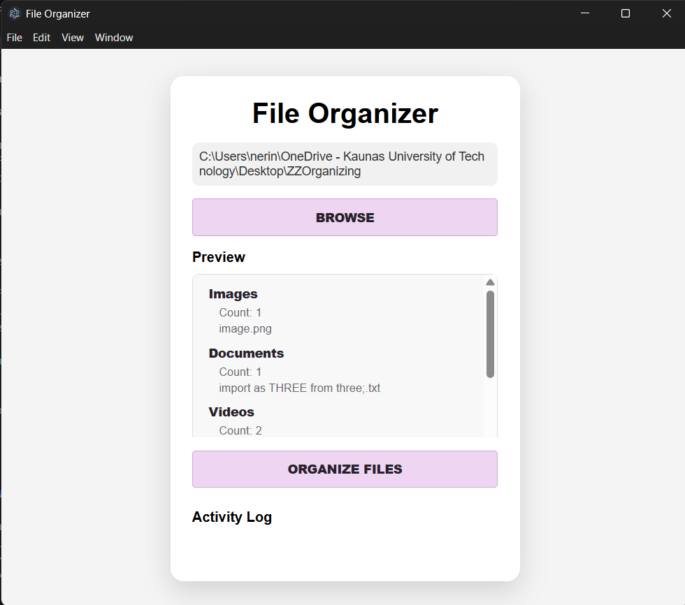

# File Organizer
A desktop file organization application built with Electron that automatically sorts files into categorized folders.

## Preview

## Features
- Select any folder from your computer
- Preview files before organizing
- Automatically categorizes files
- Creates folders automatically when needed
- Moves files into their corresponding categories
- Simple desktop interface

## Technologies Used
- Electron
- JavaScript
- HTML
- CSS
- Node.js

## How It Works
1. Select a folder using the Browse button.
2. The application scans the folder contents.
3. Files are grouped by their extensions.
4. A preview displays the detected categories and files.
5. Press "Organize Files" to create folders and move files automatically.

## Supported File Types
### Images
.jpg, .jpeg, .png, .gif, .bmp, .webp, .svg and more

### Documents
.pdf, .docx, .txt, .xlsx, .pptx, .csv and more

### Videos
.mp4, .avi, .mkv, .mov and more

### Music
.mp3, .wav, .flac, .aac and more

### Archives
.zip, .rar, .7z, .tar and more